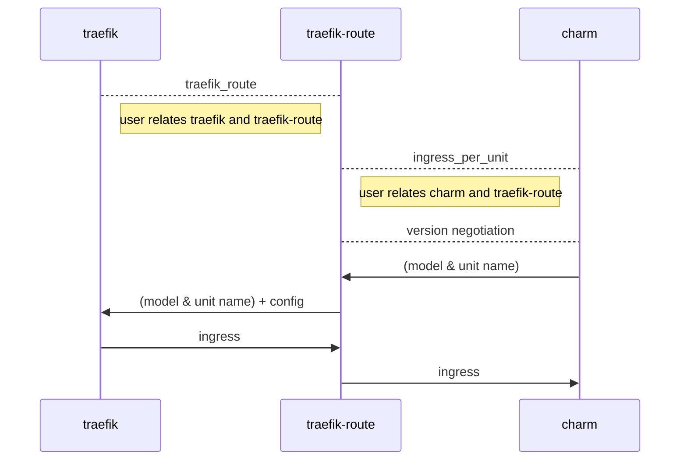

# traefik-route-k8s-operator

## Description

Traefik-route-k8s provides separation of concerns between the general needs of 
the ingress and ingress-per-unit relation interfaces, and the need to specify 
per-relation routing logic at runtime which in this case is specific to Traefik.
The traefik-k8s charm provides support for a few built-in routing types and 
optionally setting an external hostname.

The traefik-route-k8s charm proposed here addresses advanced use-cases, providing
the cloud admin full control over the routing template.

This charm allows to preserve the generality of the ingress_per_unit relation 
interface of the traefik-k8s charm, while exposing Traefik-specific 
routing configurations through a configuration charm that sits between 
traefik-k8s and the proxied application.

## Usage

The idea is that this charm sits between the charm in need of ingress, and 
traefik-k8s.  For example a juju topology for providing ingress to a 
prometheus-k8s charm could look like:


This way the complexity of configuring the ingress is hidden from the 
(developers/maintainers of the) end consumer, prometheus-k8s in this example, 
while at the same time all advanced configuration options remain available to 
the cloud admin. 

The information flow can be visualized as:


### Configuration fields:
At the moment the only configuration option available to traefik-route-k8s is 
the `rule` field: 

* `rule`: contains a Jinja 2 template that is used to populate the Traefik router’s 
  rule field. it allows the cloud admin to override the template that 
  traefik's router uses to generate ingress urls. Cfr. [traefik's documentation](https://doc.traefik.io/traefik/routing/routers/)
  for how that works more precisely.\
  The following global variables will be injected when evaluating the template:

  * `{{juju_model}}` resolves to the model name of the downstream proxied application.

  * `{{juju_application}}` resolves to the application name of the downstream 
    proxied application.

  * `{{juju_unit}}` resolves to the unit name of the downstream proxied unit 
    (this is applicable only when the ingress is performed per-unit, and in the 
    future we plan to support also application-level routing); to avoid 
    issues when used together with the Host directive or similar, 
    the slash character between application name and unit index is replaced with a dash.

For example, the rule value:

	rule=Host(\"foo.bar/{{juju_unit}}\")

will generate the following Traefik configuration file when related via the 
ingress_per_unit relation interface with a Juju application called `prometheustest` 
from the `costest` model with two units:

```yaml
http:
   routers:
     juju-costest-prometheustest-0-router:
       rule: Host(\"foo.bar/prometheustest-0\")
       service: juju-costest-prometheustest-0
       entrypoint: web
   services:
     juju-costest-prometheustest-0-service:
       loadBalancer:
         servers:
           - url: http://<unit_ingress_address>:<unit_port>
```
The `<unit_ingress_address>` and `<unit_port>` tokens are provided by each unit of 
the downstream proxied application over the ingress_per_unit relation interface.

## Relations
Provides an “ingress-per-unit” relation using the “ingress_per_unit” relation 
interface, with limit 1.

Requires a “traefik-route” relation using a “traefik_route” relation interface, 
with limit 1.

## OCI Images

This is a workload-less charm.

## Contributing

Please see the [Juju SDK docs](https://juju.is/docs/sdk) for guidelines
on enhancements to this charm following best practice guidelines, and
`CONTRIBUTING.md` for developer guidance.
